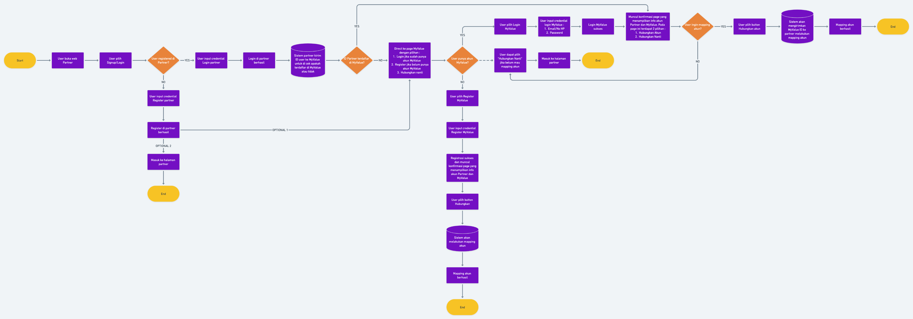

# MyValue-Partner

## 1. Introduction

Kami memahami kebutuhan anda untuk melakukan integrasi lebih dalam dengan produk kami. Kami hadir untuk mengaktifkan dan mendukung sistem anda agar terintegrasi dengan produk MyValue.

## 2. Getting Started

### Pre-Requisites

Hal yang wajib diketahui untuk menggunakan API di dokumentasi ini

- Mengetahui cara kerja REST-API. Memahami cara membuat request dan menerima response API
- Memiliki `client_id` dan `client_secret` yang sudah diberikan oleh Tim MyValue
- Mengajukan `redirect_url` ke Tim MyValue ketika ada perubahan atau penambahan alamat url
- Proses integrasi menggunakan sistem Host-to-Host (Backend to Backend) atau direct integration.

### Objective

Dengan menyelesaikan dokumentasi ini, anda dapat

- Membuat request dan menerima response API
- Memahami cara kerja API dan API mana yang dibutuhkan untuk produk anda.
- Memahami komponen yang perlu dibangun di sistem/produk anda agar sesuai dengan API MyValue

### Base URL

Sandbox Environment adalah tempat dimana kamu dapat melakukan internal end-to-end testing menggunakan kredensial _MyValue Staging_. Ketika testing sudah selesai, kamu dapat menggunakan _Production Environment_ menggunakan kredensial _MyValue Production_.

| Type         | Sandbox                       | Production                   |
| ------------ | ----------------------------- | ---------------------------- |
| External API | https://external.ovaltech.id/ | https://external.myvalue.id/ |
| SSO API      | https://auth.ovaltech.id/     | https://auth.ovaltech.id/    |

### Authentication

MyValue melakukan validasi client untuk proses integrasi ke semua partner kami. Data yang dibutuhkan untuk validasi ini adalah `client_id` dan `client_secret`. Proses autentikasi melakukan pengecekan payload sign dengan menggunakan hash sha256.

## 3. User Mapping

### Persiapan Sebelum Mengintegrasikan dengan MyValue

Berikut ini adalah alur proses user mapping yang disederhanakan antara MyValue dan Business Unit (BU)


Persyaratan yang harus dipenuhi oleh Business Unit:
1. Tidak perlu lagi melakukan mapping (buka halaman mapping MyValue) jika value_id pada pengguna BU sudah dipetakan
2. Mengirimkan data email, phone_number, user_id, client_id, app_name, redirect_uri, fallback_uri and state ke halaman mapping MyValue
3. Menyiapkan redirect url untuk proses mapping
   - <b>Silakan hubungi kami untuk mendapatkan client_id dan client_secret, serta mendaftarkan partner redirect_uri</b>
   - Tambahkan logic untuk memperbarui data pengguna value_id dalam database BU

### User Mapping dengan Business Unit

Berikut ini adalah alur proses pemetaan pengguna yang terperinci antara MyValue dan Business Unit (BU)


Untuk integrasi pemetaan pengguna, hal-hal yang harus ditangani nanti adalah sebagai berikut:
1. Pengguna yang tidak memiliki akun BU dan MyValue
2. Pengguna yang sudah memiliki akun MyValue, tetapi tidak memiliki akun BU
3. Pengguna yang sudah memiliki akun BU, tetapi tidak memiliki akun MyValue
4. Pengguna yang sudah memiliki akun BU dan MyValue dengan email atau nomor telepon yang sama
5. Pengguna yang sudah memiliki akun BU dan MyValue dengan email atau nomor telepon yang berbeda

# Integration Guide untuk Business Unit

Langkah-langkah untuk integrasi user mapping dijelaskan di bawah ini.

## Preparation
> Pada bagian ini, <i>Staging</i> environtment digunakan untuk melakukan proses integrasi.
1. Logic validasi untuk memeriksa apakah user sudah dimapping
2. Redirect uri untuk memperbarui data value_id dalam database BU.

Demo: `https://pocmapping.ovaltech.id/`

Halaman Mapping: `https://auth.ovaltech.id/authorize/mapping`

## Integration Steps Overview
1. Validasi status user mapping di backend BU
2. Tampilkan halaman mapping MyValue di frontend BU
3. Dapatkan authorization code pada redirect uri BU
4. Dapatkan access token dan data user dari MyValue API di backend BU
5. Petakan user dan value id di backend BU

<details>
<summary>Sequence Diagram</summary>
<article>

</article>
</details>


<details>
<summary>User Flow</summary>
<article>
<ol>
<li>Login/ Register melalui halaman BU</li>

<li>Jika pengguna belum dimapping dengan value_id, user akan diarahkan ke halaman mapping MyValue.</li>

<li>Klik tombol 'Hubungkan Dengan MyValue'</li>
<li>Login menggunakan akun Anda atau mendaftar akun baru</li>

<li>Masukkan kata sandi Anda untuk masuk, dan klik tombol 'Masuk'</li>

<li>Berhasil mapping akun, tunggu hingga halaman dialihkan.</li>

<li>Diarahkan ke halaman redirect BU.</li>

<li>Setelah semua proses mapping selesai, user akan diarahkan kembali ke halaman BU</li>
</ol>
</article>
</details>

## 1. Validasi status mapping user di backend BU.

Saat pengguna berhasil login/register di frontend BU, periksa status mapping user.

<b>Jika user belum dimapping dengan value_id</b>, user akan diarahkan ke halaman mapping MyValue. Sementara itu, <b>jika pengguna sudah dipetakan dengan value_id</b>, maka user dapat langsung diarahkan ke halaman aplikasi BU.

## 2. Tampilkan halaman mapping MyValue di frontend BU

Untuk membuka halaman mapping MyValue, BU harus mengirimkan informasi pengguna. Setidaknya ada 7 data yang diperlukan untuk melakukan pemetaan di MyValue yang dijelaskan dalam tabel berikut.

| Parameter                                  | Required           | Type   | Description                                                                  |
| ---------------------------------------------|-------- | ------ | ---------------------------------------------------------------------------- |
| user_id |<span style="color:red;">required</span>      | String | BU user id                                                                   |
| client_id |<span style="color:red;">required</span>    | String | Client id BU                                                                 |
| app_name |<span style="color:red;">required</span>     | String | Nama aplikasi unit bisnis yang akan ditampilkan di halaman mapping MyValue                  |
| full_name |<span style="color:red;">required</span>    | String | Nama lengkap user                                  |
| redirect_uri |<span style="color:red;">required</span> | String | redirect uri yang telah didaftarkan                                                   |
| fallback_uri| <span style="color:red;">required</span> | String | Untuk user yang membatalkan proses mapping, akan diarahkan ke fallback uri ini |
| state        |optional                                         | String | State to prevent CSRF attacks                                                |
| email         |optional                                        | String | Email user                                      |
| phone_number  |optional                                        | String | Nomer telepon user                                   |

> Antara email dan nomor telepon minimal diberikan 1 data.

Example:
```
https://auth.ovaltech.id/authorize/mapping?user_id=id1&email=albert@oval.id&client_id=yourclientid&app_name=yourappname&full_name=yourname&redirect_uri=https://yourwebsite.com/redirect&fallback_uri=https://yourwebsite.com/home
```

## 3. Mendapatkan authorization code di redirect uri BU
Redirect uri terdaftar akan diberikan parameter bernama <b>code</b>. Kode ini nantinya akan digunakan untuk mendapatkan access token untuk mengakses API pengguna MyValue.

Example:
```
https://yourwebsite.com/redirect?code=zCTgNrHq9FfuLxBpuvrtLIXJt24kDkcCEQYTLF1Yg1I.XZEK69gwAa7DSzHLil_1tzfKkOeZfpgYyCvys658QNo&scope=fosite%20offline%20openid&state=stateA
```

## 4. Mendapatkan access token dan user data dari MyValue API di backend BU
> Mendapatkan Access Token

Gunakan Authorization Code (code), BU perlu memanggil POST request ke endpoint token untuk mendapatkan access token.

Example CURL request :

```sh
curl --request POST \
--url 'https://auth.ovaltech.id/auth/token' \
--header 'content-type: application/json' \
--data '

{
    "grant_type":"authorization_code",
    "client_id": "YOUR_CLIENT_ID",
    "client_secret": "YOUR_CLIENT_SECRET",
    "code": "YOUR_AUTHORIZATION_CODE",
    "redirect_uri": "https://YOUR_APP/callback"
}'
```

Dimana:

- grant_type : Nilainya harus `authorization_code`
- client_id : Client id BU
- client_secret : Client secret BU
- code : Authorization Code yang diterima pada redirect uri
- redirect_uri : URL nya harus sama dari redirect uri yang telah didaftarkan

> Mendapatkan User Data

Data <b>access_token</b> yang didapatkan dari respon API token diatas dapat digunakan untuk memperoleh user data.

Example CURL request:
```sh
curl --location 'https://auth.ovaltech.id/auth/introspect/' \
--header 'Content-Type: application/json' \
--data '{
    "access_token":"USER_ACCESS_TOKEN"
}'
```

Dimana:
- access_token : Merupakan data access token yang diperoleh dari endpoint token sebelumnya

## 5. Mapping user dan value id di backend BU
Dari API introspect di atas, BU dapat memperoleh respon <b>valueID</b> pengguna. Kemudian tambahkan logic untuk memperbarui data value_id user dalam database BU untuk menyelesaikan proses pemetaan.